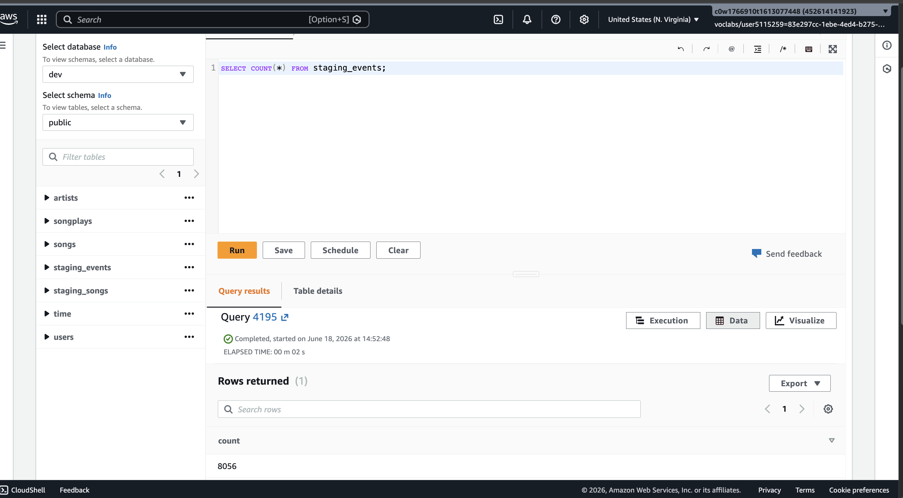
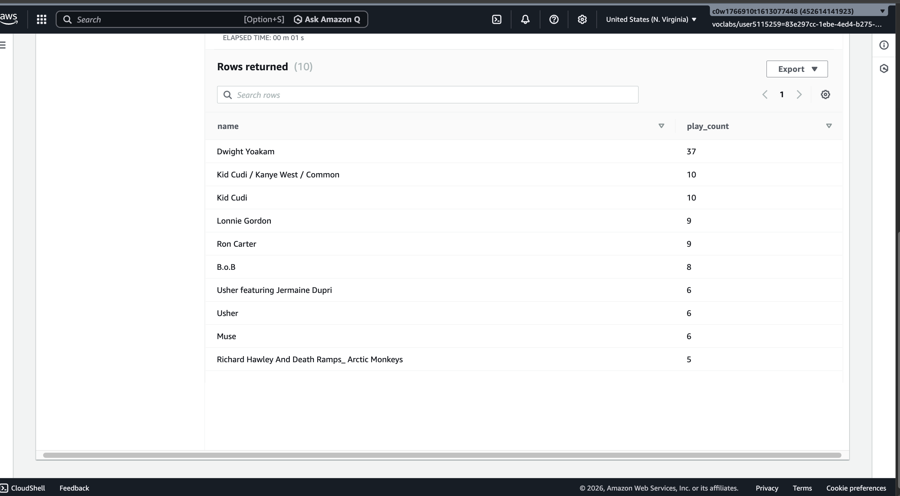
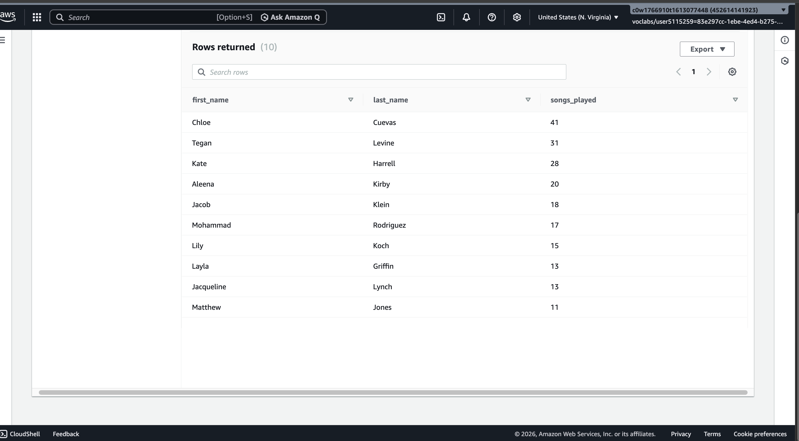
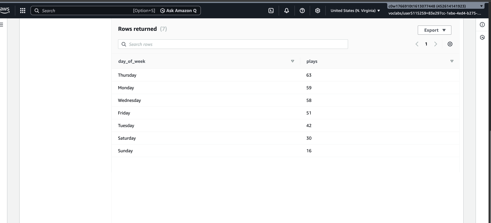

# Sparkify Data Warehouse 

## Overview 

This project focuses on creating a data warehouse for Sparkify. sparkify is a fictional music stremaing company that wants to analyse user listening activity and gain insights into user behaviour, songs, artists, and usage patterns. The as-is system for sparkify entails storing song metadata and application event logs in JSON files which are hosted on Amazon S3. The way the data is stored does not support efficient analitical querying. 

The objective of this project is to build an ETL piupeline that extracts data from Amazon s3, stages the data in Amazon redshift, and then transforms it into a dimensional data model optimised for analytics and reporting. The resulting data warehouse enables Sparkify to answer business questions including but not limited to:
* Most frequently played songs 
* Most popular artists
* What are the busiest streaming days?
* What times are users most active?

## Repository Files

- `create_tables.py` – Drops existing tables and creates staging and analytics tables in Amazon Redshift.
- `etl.py` – Loads data from S3 into staging tables and transforms the data into the star schema.
- `sql_queries.py` – Contains all SQL statements used by the ETL pipeline.
- `dwh.cfg` –  Configuration file containing the required parameters for connecting to Redshift and S3.
- `README.md` – Project documentation and instructions.
- `images/` – Screenshots of ETL validation and analytical query results.


## How to Run the Project

1. Create a Redshift cluster and IAM role with S3 read permissions.
2. Update the configuration file with Redshift endpoint and IAM role ARN.
3. Create the tables by running: 

```bash
python create_tables.py
```

4. Run the ETL pipeline:

```bash
python etl.py
```

5. Validate the load by running analytical queries in Redshift Query Editor.


# Database Schema Design

The star schema was implemented for this project because it provides a simple, effortless structure for analytical workloads and reduces the number joins that are required to answer business questions. The design consists of one fact table (song_plays), four dimension tables and two staging tables. 

## Fact Table

### songplays

This table stores records of song play events.

**Columns:**

* songplay_id
* start_time
* user_id
* level
* song_id
* artist_id
* session_id
* location
* user_agent

## Dimension Tables

### users

This table stores information about all Sparkify users. 

**Columns:**

* user_id
* first_name
* last_name
* gender
* level

### songs

This table stores information about songs.

**Columns:**

* song_id
* title
* artist_id
* year
* duration

### artists

This table stores information about artists.

**Columns:**

* artist_id
* name
* location
* latitude
* longitude

### time

This table stores timestamps associated with song play events.

**Columns:**

* start_time
* hour
* day
* week
* month
* year
* weekday


## Dimension Tables

### staging_events
This is the staging table used to store raw application event log data loaded from S3. 

### staging_songs
This is the staging table used to store raw somg metadata loaded from S3. 


# Configuration

Sensitive configuration values such as database passwords, endpoints, and AWS credentials have been omitted from this repository. A template configuration file (dwh_template.cfg) has been provided to demonstrate the expected configuration structure.


# ETL Pipeline

The ETL pipeline created for Sparkify consists of the following steps:
1. Create the staging and anlytics tables in Amazon redshift.
2. The raw JSON data from Amazon S3 is loaded into the staging tables using Redshift COPY commands 
3. The data is transformed and loaded from the staging tables into fact and dimension tables.
4. The analytical queries are executed against the dimensional model. 

The project consists of three Python scripts:

#### create_tables.py

Drops existing tables and recreates all staging and analytics tables.

#### sql_queries.py

This contains all SQL statements used to create tables, load staging tables, and populate the star schema.

#### etl.py
This loads data from S3 into staging tables and inserts transformed data into the analytics tables. 


# ETL Pipeline

The ETL pipeline successfully ran without errors and was able to connect to the Sparkify redshift database, it also successfully loaded log_data and song_data into staging tables, and then transformed them into the five tables. Below shows the row counts for each of the tables:


| **Table**      | **Row count**
| -------------- | ------------ |
| staging_events | 8,056        |
| staging_songs  | 14,896       |
| songplays      | 6,820        |
| users          | 104          | 
| songs          | 14,896       |
| artists        | 10,025       |
| time           | 6,813        |


**Screenshot**




# Example Analytical Queries 

## Most popular artists 

This query was created to identify artists whose songs are played most frequently. This insight can help Sparkify understand which artists drive the most engagement and can inform promotional decisions.

``
SELECT a.name, COUNT(*) AS play_count
FROM songplays sp
JOIN artists a
    ON sp.artist_id = a.artist_id
GROUP BY a.name
ORDER BY play_count DESC
LIMIT 10;

``

**Result**




## Most active users 

These query answers the question regarding the most prominet of Sparkify. This query can help Sparkify target loyalty initiatives, evaluate user retention, and better understand listening behaviours. 

``
SELECT
    u.first_name,
    u.last_name,
    COUNT(*) AS songs_played
FROM songplays sp
JOIN users u
    ON sp.user_id = u.user_id
GROUP BY
    u.first_name,
    u.last_name
ORDER BY songs_played DESC
LIMIT 10;
``

**Result**



## Listening activity by weekday

This query looks at what day of the week has the highest listening activity and can help Sparkify to optimise marketing campaigns, and plan infrastructure resources around peak usage periods. n

``
SELECT
    weekday,
    COUNT(*) AS plays
FROM time t
JOIN songplays sp
    ON t.start_time = sp.start_time
GROUP BY weekday
ORDER BY plays DESC;
``

**Result**



## Technologies used 

- Python
- Amazon Redshift
- Amazon S3
- IAM Roles
- SQL
- psycopg2
- Jupyter Notebook

